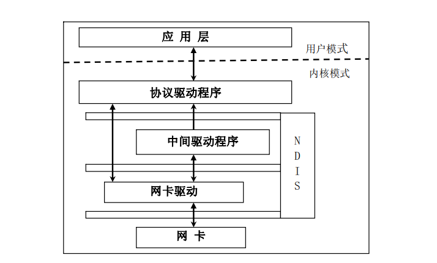
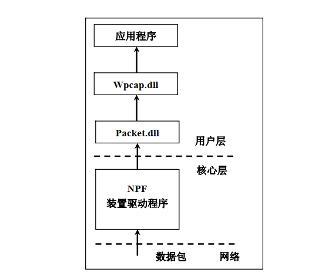

介绍
======

从本文开始将对 **Pcap4J**（下文简称为 **p4**）提供的样例代码进行注释讲解，期间还包括了对 **Pcap 原理**的解读

****

每篇文章讲解一个样例，目录如下：

目录
-----

- [Loop（本篇文章）](#Loop)
  - [原理](#原理)
  - [步骤](#步骤)
  - [实现](#实现)
  - [总结](#总结)
- [HeavyLoop](./3-sample-HeavyLoop.md)
- [Dump](./4-sample-Dump.md)
- [DumpLoop](./5-sample-DumpLoop.md)
- [GetNextPacket](./6-sample-GetNextPacket.md)
- [GetNextPacketEx](./7-sample-GetNextPacketEx.md)
- [DefragmentEcho](./8-sample-DefragmentEcho.md)
- [IcmpV4ErrReplyer](./9-sample-IcmpV4ErrReplyer.md)
- [SendArpRequest](./10-sample-SendArpRequest.md)
- [SendFragmentedEcho](./11-sample-SendFragmentedEcho.md)
- [PacketStream](./12-sample-PacketStream.md)
- [PcapFileMerger](./13-sample-PcapFileMerger.md)
- [ReadPacketFile](./14-sample-ReadPacketFile.md)
- [Docket](./15-sample-Docket.md)

****

Loop
------

#### 原理 #####

由于 **p4** 在源头上是基于 **WinPcap**，故只需阐述 **WinPcap** 原理即可

- 捕获原理

  - 工作模式

    网卡有四种工作模式，分别为

    > 广播模式、多播传送、直接模式、混杂模式
    >
    > 其中**广播**和**直接**是网卡的基本模式或称为**缺省模式**，而多播传送模式不常用，混杂模式则是抓包程序常用模式

    注意：网卡的工作模式**只在共享环境下起作用**，而**在交换环境下数据包由交换机控制，网卡的工作模式被忽略**

  - 共享环境

    由 Hub 组成，已淘汰

    - 广播模式：网卡接受广播帧（目的 MAC 为 0xffffff）
    - 直接模式：网卡只接受目的 MAC 为自己 MAC 的帧
    - 混杂模式：接受所有流经网卡的帧

    注意：混杂模式下网卡**只可以侦听而不可以转发**，因为帧并不是发给自己的，与交换环境下的 **ARP 欺骗**及**中间人**相区别

  - **交换环境**

    由交换机组成，目前几乎所有网络都处于交换环境，因此经过上面的介绍可知，在**交换环境下网卡只会处于缺省模式，即只处于广播和直接模式**，而**混杂模式**只可以侦听本广播网段的所有数据包，所以想要侦听整个网络的数据包需要特殊手段，手段如下

    - ARP 欺骗：在上一篇文章：[开始]()已经实现了简单的 ARP 欺骗，使得我们的程序可以侦听网络上所有的数据包
    - MAC 地址欺骗：我们还可以将本机的 MAC 伪造为默认网关的 MAC，达到侦听网络数据包的目的
    - ICMP：包括 ICMP 重定向报文、ICMP 路由公告

    在实现了**真正的混杂模式**之后，我们就可以在此基础上实现**中间人**，达到拦截及转发数据包的目的

- WinPcap 架构

  - NDIS：由 NIC 及 NIC drivers、中间层驱动（小端口、虚拟驱动）、协议驱动及传输驱动构成

    

    WinPcap 在 Win32 平台的运行需要 NDIS（网络驱动器接口标准）的支
    撑，而 NDIS 是 Windows 内核中最低层的网络部分，这里不做过多介绍

  - NPF：包过滤驱动程序 NPF 是WinPcap 的体系结构的核心也是 最基本的功能单元，NPF 是在 BPF 的基础上开发出来的，它保留了 BPF 的
    核心模块，BPF 结构如图：

    

    简单地说 BPF 包捕获机制其实就是在数据链路层加上一个旁路处理

    **NPF 与 BPF 在功能上大体相同，NPF 只是在性能及其他方面上对 BPF 进行了改进**

- WinPcap 功能模块

  如图：

  

#### 步骤 ####

- 初始化，打开、读取网卡，设置过滤器规则，及设置网卡模式
- 处理、编译过滤规则
- 捕获数据包，及进行其他操作（可自己设置回调函数）
- 捕获完毕，关闭网卡

#### 实现 ####

**以上粗略的介绍了包捕获等等的原理机制，如有疑惑可自行搜索，在之后的文章中不再介绍重复内容，而是直接分析样例代码，另外对于简单的代码，讲解会直接反正代码注释之中**

```java
package org.pcap4j.sample;

import com.sun.jna.Platform;
import java.io.IOException;
import org.pcap4j.core.BpfProgram.BpfCompileMode;
import org.pcap4j.core.NotOpenException;
import org.pcap4j.core.PacketListener;
import org.pcap4j.core.PcapHandle;
import org.pcap4j.core.PcapNativeException;
import org.pcap4j.core.PcapNetworkInterface;
import org.pcap4j.core.PcapNetworkInterface.PromiscuousMode;
import org.pcap4j.core.PcapStat;
import org.pcap4j.util.NifSelector;

@SuppressWarnings("javadoc")
public class Loop {

  // 设置 COUNT 常量，代表本次捕获数据包的数目，其中 -1 代表一直捕获
  private static final String COUNT_KEY = Loop.class.getName() + ".count";
  private static final int COUNT = Integer.getInteger(COUNT_KEY, 1);

  // 等待读取数据包的时间（以毫秒为单位），其中 -1 代表一直等待
  private static final String READ_TIMEOUT_KEY = Loop.class.getName() + ".readTimeout";
  private static final int READ_TIMEOUT = Integer.getInteger(READ_TIMEOUT_KEY, 10); // [ms]

  // 要捕获的最大数据包大小（以字节为单位）
  private static final String SNAPLEN_KEY = Loop.class.getName() + ".snaplen";
  private static final int SNAPLEN = Integer.getInteger(SNAPLEN_KEY, 65536); // [bytes]

  private Loop() {}

  // 主函数
  public static void main(String[] args) throws PcapNativeException, NotOpenException {

    // 设置过滤器规则，为标准 BPF 规则表达式，如 args 为空则规则为 “”
    String filter = args.length != 0 ? args[0] : "";

    System.out.println(COUNT_KEY + ": " + COUNT);
    System.out.println(READ_TIMEOUT_KEY + ": " + READ_TIMEOUT);
    System.out.println(SNAPLEN_KEY + ": " + SNAPLEN);
    System.out.println("\n");

    // 声明包捕获网络接口对象
    PcapNetworkInterface nif;
    try {
      // 这一句是调用了已经封装好的命令行网卡选择函数，建议在开发自己的程序时不使用这个函数
      // 可以使用如下代码获取网卡列表
      /*
      import java.io.IOException;
      import org.pcap4j.core.PcapNetworkInterface;
      import org.pcap4j.core.PcapNativeException;
      import org.pcap4j.core.Pcaps;
      List allDevs = null;

        try {
            allDevs = Pcaps.findAllDevs();
        } catch (PcapNativeException var3) {
            throw new IOException(var3.getMessage());
        }

        if (allDevs != null && !allDevs.isEmpty()) {
            // do something
            int deviceNum = 0;
            PcapNetworkInterface nif = Pcaps.getDevByName(alldev.get(deviceNum).getName());
        } else {
            throw new IOException("No NIF to capture.");
        }
       */
      nif = new NifSelector().selectNetworkInterface();
    } catch (IOException e) {
      e.printStackTrace();
      return;
    }

    if (nif == null) {
      return;
    }

    // 输出你选择了的网卡信息，其中 nifName 为 网卡标识，nifDescription 为 网卡显示名称
    System.out.println(nif.getName() + "(" + nif.getDescription() + ")");

    // 打开网卡，其中 PromiscuousMode 为网卡是否选择混杂模式（注：交换环境下混杂模式无效，只会侦听本广播网段的数据包）
    // 其中 PcapHandle 对象指的是对网卡的一系列操作，且 一个 PcapHandle 对象对应抓一个网卡的报文
    // 所以要捕获多网卡就要设置多个 PcapHandle，这就为同时进行多个抓包提供了可能
    final PcapHandle handle = nif.openLive(SNAPLEN, PromiscuousMode.PROMISCUOUS, READ_TIMEOUT);

    // 设置网卡过滤器
    if (filter.length() != 0) {
      handle.setFilter(filter, BpfCompileMode.OPTIMIZE);
    }

    // 开始侦听，其中 PacketListener 实现了一个接口，本代码直接输出了 PcapPacket 对象
    PacketListener listener = packet -> System.out.println(packet);
    // 我们在自己的程序中可以实现这个接口的回调函数：void gotPacket(PcapPacket var1);
    /*
    抓到报文回调gotPacket方法处理报文内容
    PacketListener listener =
        new PacketListener() {
          @Override
          public void gotPacket(Packet packet) {
            // 抓到报文走这里...
            System.out.println(handle.getTimestamp());
            System.out.println(packet);
          }
        };
     */


    // 调用 loop 函数（还有许多其他捕获数据包的方法，日后再说）进行抓包，其中抓到的包则回调 listener 指向的回调函数
    try {
      handle.loop(COUNT, listener);
    } catch (InterruptedException e) {
      e.printStackTrace();
    }

    // PcapStat 对象为本次抓包的统计信息
    PcapStat ps = handle.getStats();
    System.out.println("ps_recv: " + ps.getNumPacketsReceived());
    System.out.println("ps_drop: " + ps.getNumPacketsDropped());
    System.out.println("ps_ifdrop: " + ps.getNumPacketsDroppedByIf());
    if (Platform.isWindows()) {
      System.out.println("bs_capt: " + ps.getNumPacketsCaptured());
    }

    // 关闭网卡
    handle.close();
  }
}

```


#### 总结 ####

- 本文介绍抓包的基本原理（同样适用于之后的所有程序）
- 并归纳了抓包程序的一般步骤
- 详细的注释了样例代码（关于源代码的部分没有深入介绍，因为没有太大的必要，**p4** 已经对其进行了再封装，原理是一致的）

